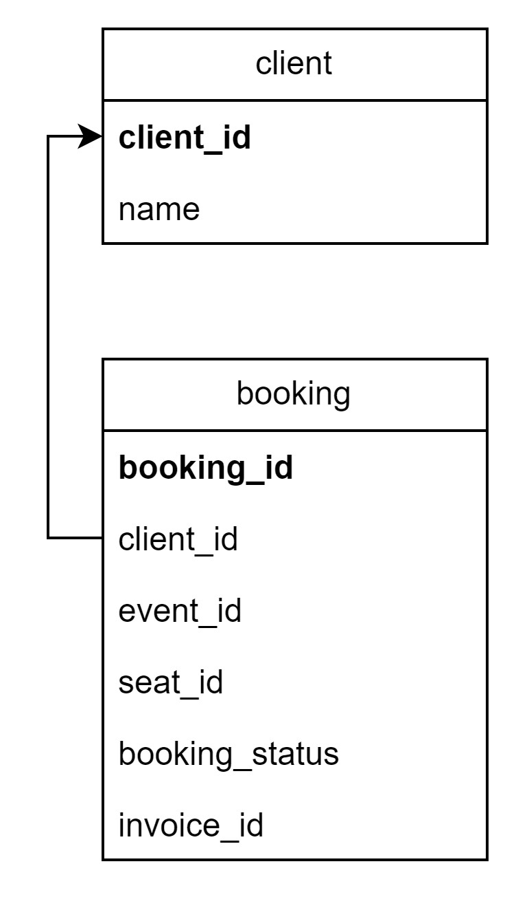

# Client App

## **Table of Contents**
* [Documentation Description](#documentation-description)
* [Database Schema](#database-schema)
* [HTTP APIs](#http-apis)
* [PIC](#pic)

## **Documentation Description**

This documentation is used to display needed all API and services which provided by the Client application.

## **Database Schema**

## **HTTP APIs**

| HTTP Method | Endpoint   | Description              |
| ----------- | ---------- | ------------------------ |
| GET         | /clients   | Get client data          |
| POST        | /clients   | Insert a new client data         |
| GET         | /bookings  | Get client booking data       |
| GET         | /events/   | Get call events data     |
| GET         | /events/{event_id} | Get specific event data |
| GET         | /seats?event_id=&seat_number= | Get specific data for a seat of an event |
| PATCH       | /seats     | Update a specific seat data |

<!-- | GET         | /invoice?invoice_id | Get a specific invoice data |
| PATCH       | /orders     | Update an order |
| PATCH       | /invoice     | Update an invoice | -->

## **PIC**
| Student ID | Name |
|------------|-------|
| 13521116   | Juan Christopher Santoso |

