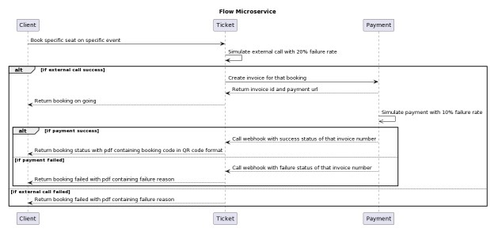

# IF4031 Pengembangan Aplikasi Terdistribusi

## Tugas Besar_K02_G05

## **Table of Contents**
* [Program Description](#program-description)
* [Service Flow Diagram](#service-flow-diagram)
* [Required Program](#required-program)
* [Execution Guide](#execution-guide)
* [Functionalities](#functionalities)
* [Author](#author)

## **Program Description**
The program is used as a ticket booking program, consisting of three application, Client application, Ticket application, and Payment application. Client application handles all input from users and display output to users. Ticket application handles requests from Client application, process it, and then forward it to Payment application. Lastly, Payment application finalizes user requests and send the respond to Ticket application which later be forwarded to Client application.

## **Service Flow Diagram**

## **Required Program**

## **Execution Guide**

## **Functionalities**

### Client App
System Entity | Tech
--- | --- 
API Server | Nama stack yang digunakan untuk API Server
Database | Nama stack yang digunakan untuk DB
??? | Untuk hal lain (MQ/Cache/dkk)

### Ticket App
System Entity | Tech
--- | --- 
API Server | Nama stack yang digunakan untuk API Server
Database | Nama stack yang digunakan untuk DB
??? | Untuk hal lain (MQ/Cache/dkk)

### Payment App
System Entity | Tech
--- | --- 
API Server | Nama stack yang digunakan untuk API Server
Database | Nama stack yang digunakan untuk DB
??? | Untuk hal lain (MQ/Cache/dkk)

## **Author**
NIM | Nama
--- | --- 
13521056 | Daniel Egiant Sitanggang
13521092 | Frankie Huang
13521116 | Juan Christopher Santoso
