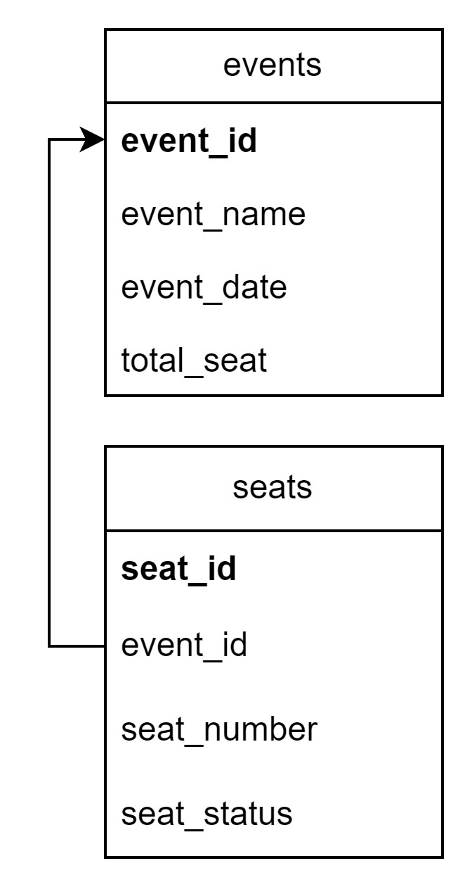

# Ticket App

## **Table of Contents**
* [Documentation Description](#documentation-description)
* [Database Schema](#database-schema)
* [HTTP APIs](#http-apis)
* [PIC](#pic)

## **Documentation Description**

This documentation is used to display needed all API and services which provided by the Ticket application.

## **Database Schema**

## **HTTP APIs**

| HTTP Method | Endpoint   | Description              |
| ----------- | ---------- | ------------------------ |
| GET         | /clients   | Get client data          |

## **PIC**
| Student ID | Name |
|------------|-------|
| 13521092   | Frankie Huang |

